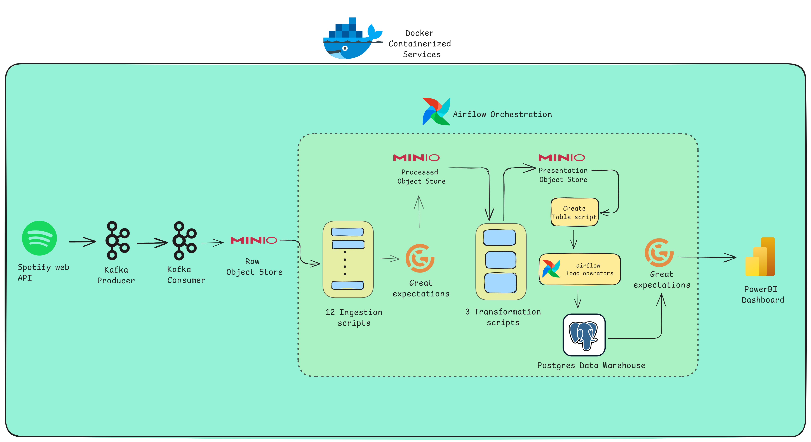
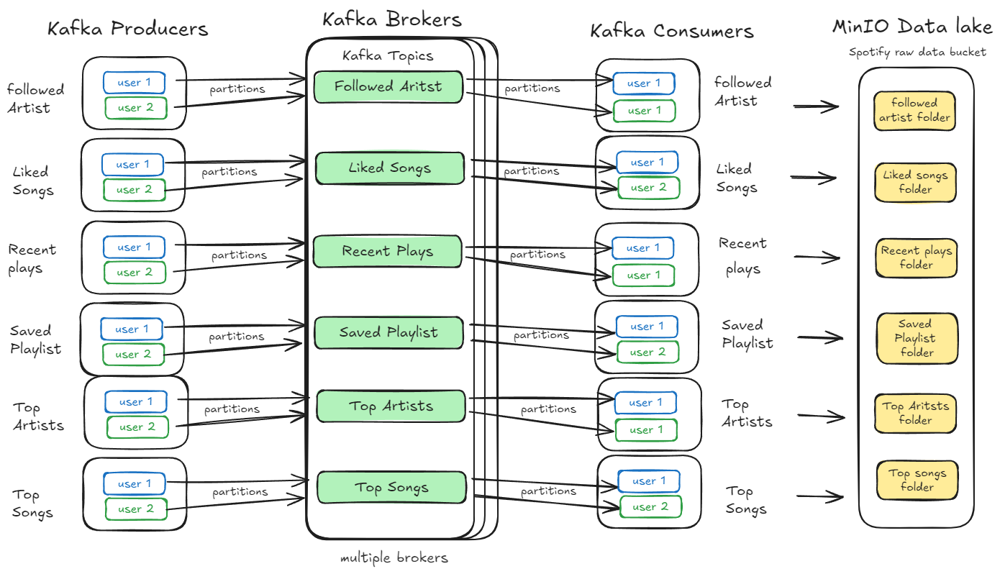
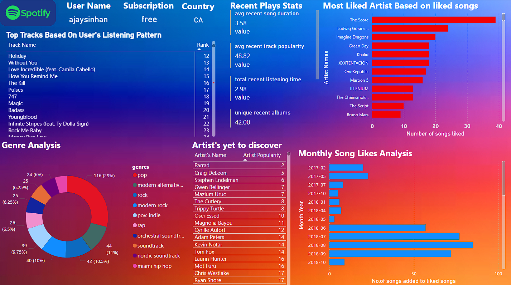

# Spotify End2End Data Pipeline: Insights Through Comprehensive Visualization

## Project Overview

This project creates an end-to-end data pipeline that tries to replicate Spotify Wrapped functionality with a PowerBI dashboard, allowing users to view their personalized music insights at any time. The pipeline extracts data from the Spotify Web API, processes it using modern data engineering technologies, and presents user-friendly visualizations.

## Architecture Diagram



### The data pipeline consists of the following components

- **Data Extraction**: Spotify Web API
- **Message Broker/Event Streaming**: Apache Kafka
- **Data Processing**: Pandas,SQL
- **Data Lake**: MinIO( S3 compatible Object Store )
- **Orchestration**: Apache Airflow
- **Data Warehouse**: Postgres Data Warehouse
- **Visualization**: PowerBI
- **Containerization**: Docker

## Apache Kafka Workflow



The system is designed for high scalability, capable of serving millions of concurrent users. Each Kafka topic is partitioned to efficiently manage thousands of users per topic. To accommodate growing user bases, we can horizontally scale by deploying additional Kafka brokers with replicated topics. This architecture ensures seamless performance and data throughput even as user numbers increase dramatically.

## Features

- Daily data extraction from Spotify Web API
- Processing of user listening history, top tracks, and artists
- Calculation of listening trends and preferences
- Interactive dashboard for viewing personalized insights
- Scalable architecture to handle millions of users

## Spotify Insight Dashboard using PowerBI


You can find this dashboard under the dashboard folder.

## Technologies and Challenges

This section details the specific technologies used in our pipeline and the challenges we encountered with each.

### Data Extraction: Spotify Web API

- **Usage**: 
   We utilized the Spotify Web API to extract user data including liked songs, recently played tracks, saved playlists, and other user-specific information. We implemented 8 Kafka producers to interact with different endpoints of the Spotify API, each responsible for retrieving specific types of data
- **Challenges faced**: 
  - **Rate Limiting**: The Spotify API has rate limits that restrict the number of requests that can be made within a certain timeframe. We had to implement a robust rate limiting strategy to ensure our application didn't exceed these limits while still retrieving all necessary data.
  - **Data Consistency**: As user data on Spotify can change frequently, ensuring data consistency across multiple API calls and maintaining an up-to-date representation of the user's Spotify activity was challenging. We implemented checks to detect and handle data discrepancies.

### Message Broker/Event Streaming: Apache Kafka

- **Usage**:
  We implemented Apache Kafka as the core message broker and event streaming platform in our data pipeline. We created 8 Kafka producers, each responsible for extracting specific types of data from the Spotify API (e.g., liked songs, recent plays, saved playlists). These producers send data to 8 corresponding Kafka topics. We also developed 8 Kafka consumers that read from these topics and write the data to MinIO, our S3-compatible object store. To ensure data integrity and schema evolution, we implemented Avro schemas along with Avro serializers and deserializers for data validation during the producer-to-consumer data transfer.

- **Challenges faced**: 
  - **Schema Evolution and Compatibility**: Implementing Avro schemas for data serialization and deserialization presented challenges when the Spotify API response structure occasionally changed. We had to develop a robust schema evolution strategy to handle these changes without breaking our pipeline, ensuring backward and forward compatibility.
  - **Data Validation and Error Handling**: With Avro schemas in place, we needed to implement comprehensive error handling mechanisms to deal with instances where incoming data didn't match the expected schema
  - **Performance Optimization**: Balancing the benefits of schema validation with the need for high-throughput data processing required careful tuning. We had to optimize our Avro serialization and deserialization processes to minimize their impact on overall system performance.
  
### Data Processing: Pandas, SQL

- **Usage**: 
   We utilized Pandas for data manipulation and preprocessing of the raw JSON data extracted from Spotify. Pandas was instrumental in transforming the data into structured formats suitable for analysis. SQL was employed for loading processed data into our PostgreSQL data warehouse. We used both technologies in our ETL pipeline, orchestrated by Apache Airflow, to perform operations such as data cleaning, feature engineering, and creating analytical datasets.

- **Challenges faced**: 
  - **Complex Data Transformations**: Some of the required transformations, particularly for creating insights like genre analysis and artist discovery recommendations, involved complex operations. Balancing the use of Pandas for its flexibility and SQL for its performance in handling joins and aggregations required careful consideration.
  - **Data Type Consistency**: Ensuring consistency in data types across different Spotify API responses and maintaining this consistency through various transformation stages was challenging. We implemented robust data type checking and conversion mechanisms to maintain data integrity throughout the processing pipeline.

### Data Checks: Apache Great Expectations

- **Usage**: 
  We integrated Apache Great Expectations into our data pipeline to ensure data quality and consistency throughout the ETL process. We implemented data quality checks at multiple stages: after initial data extraction from the Spotify API, during the transformation phase, and before loading data into the PostgreSQL data warehouse. We used Great Expectations to define and enforce data schemas, validate data types, check for null values.

- **Challenges**:
  - **Integration with Apache Airflow**: Incorporating Great Expectations into our Airflow-orchestrated pipeline required careful configuration. We had to implement custom Airflow operators to run Great Expectations checkpoints within our DAGs, ensuring that data quality checks were seamlessly integrated into our workflow without impacting performance.


### Data Lake: MinIO

- **Usage**:
    We implemented MinIO as our S3-compatible object storage solution to serve as the data lake for our Spotify data engineering project. MinIO was used to store raw JSON data from Kafka consumers in a 'Raw' bucket, processed data in a 'Processed' bucket, and transformed analytical data in a 'Presentation' bucket. This tiered storage approach allowed us to maintain data lineage and support various stages of our ETL pipeline. MinIO's S3 compatibility enabled seamless integration with our other tools and services, providing a scalable and high-performance foundation for our modern data lake architecture.

- **Challenges**:

  - **Security and Access Control**: Ensuring proper security measures and access controls in a multi-user environment was challenging. We implemented MinIO's Identity and Access Management (IAM) policies to provide fine-grained access control, and integrated with our existing authentication systems to maintain a secure data lake environment.

### Orchestration: Apache Airflow

- **Usage**: We utilized Apache Airflow to orchestrate and automate our entire Spotify data pipeline. We created a DAG (Directed Acyclic Graph) that defined the workflow, including tasks for data extraction from the Spotify API, data processing with Pandas and SQL, data quality checks with Great Expectations, and data loading into our MinIO data lake and PostgreSQL data warehouse. To handle various aspects of our pipeline, we implemented six custom operators:
  - Python Operator
  - PostgreSQL Operator
  - LoadDimOperator (for dimensional tables)
  - LoadFactOperator (for fact tables)
  - LoadTransformationOperator (for transformation tables like user_music_preferences and recent_plays_analysis)
  - LoadGreatExpectationsOperator (for data quality checks)
  
- **Challenges**: 
  - **Complex Workflow Management**: Designing an efficient DAG that accurately represented our complex data pipeline was challenging. As our DAG's complexity grew, we encountered DagBag Parsing timeout errors. To address this, we had to deconstruct our DAG into separate files, reducing parsing time and improving overall performance.
  - **Custom Operator Development**: Creating and maintaining six custom operators required significant effort. We had to ensure these operators were robust, efficient, and compatible with Airflow's execution model while also integrating smoothly with our external services and data quality checks.
  - **Docker Integration**: Setting up the Airflow service in our Docker Compose environment was tedious. We had to mount our entire project inside the Airflow service and install all required Python packages within the Airflow container. This process required careful configuration management and testing to ensure consistency across development and production environments.

### Data Warehouse: PostgreSQL

- **Usage**:
   We implemented PostgreSQL as our data warehouse solution to store and manage the processed data from our Spotify data engineering pipeline. We utilized PostgreSQL's robust features to create a structured data model with fact and dimension tables. The database was designed to handle analytical workloads, storing user activity data, song metadata, and derived insights from our data transformations.

### Visualization: PowerBI

- **Usage**:
   We utilized PowerBI as our primary data visualization tool to create interactive dashboards and reports from our processed Spotify data. We leveraged PowerBI's rich set of visualization options, including custom visuals, to create compelling and insightful representations. For instance, users can view their genre analysis, top songs based on their listening habits etc. 


### Containerization: Docker

- **Usage**:
  We utilized Docker to containerize and orchestrate our entire Spotify data pipeline infrastructure. Our docker-compose file defines and manages multiple services including:
  - Apache Kafka and Zookeeper for message queuing
  - MinIO for S3-compatible object storage
  - PostgreSQL databases for Airflow metadata and our data warehouse
  - Apache Airflow services (webserver, scheduler, and init)
  Docker allowed us to create a consistent and reproducible environment across development and production, ensuring all components of our pipeline work together seamlessly.

- **Challenges**:
  - **Complex Service Dependencies**: Managing the interdependencies between services, especially ensuring proper startup order for Kafka, Zookeeper, and the databases, required careful configuration of the depends_on directives and health checks.
  - **Environment Variable Management**: Securely managing environment variables across multiple services, particularly for sensitive information like database credentials and Airflow's Fernet key, necessitated the use of .env files and careful consideration of variable scoping.
  - **Volume Management and Data Persistence**: Configuring volumes for data persistence, especially for MinIO and PostgreSQL, while ensuring proper permissions and data integrity across container restarts, required careful planning and testing.

## Setup and Installation ( Stage 1 in development)

### Step 1: **Setup Spotify Web API**

Before cloning the repository, it is necessary to set up the Spotify Web API by signing into the [Spotify Web API website](https://developer.spotify.com/). After signing in, the username in the top right corner should be clicked, followed by selecting the dashboard. The Create App button must be clicked, and the following details should be entered:
- Before cloning the repository, you must setup your spotify web api by siging into this website: 
- After signing in, click on the username in top right corner. Proceed by clicking on dashboard.
- Here, you need to click on **create app** button and proceed to enter the details as follows.
- **App name** : This can be named as desired.
- **App description** : End to End Data Pipeline.
- Leave the **Website**: Blank.
- **Redirect URIs**: `http://localhost:8080`.
- Under **Which API/SDKs are you planning to use**, choose **Web API**.
The terms of service must be accepted, and then the Save button should be clicked.

### Step 2: **Clone the repository** 🚀

- The project's clone URL should be copied, and navigation to the local directory where the repository will be cloned is required using Git Bash or CMD. The repository can then be cloned by executing: git clone <paste the url>. It is recommended to create a virtual environment for this project to avoid package conflicts. Once cloned, the required dependencies must be installed using: pip install -r requirements.txt.
Next, a .env file needs to be created in the root of the project directory. Two keys for Apache Airflow must be generated: AIRFLOW_SECRET_KEY and AIRFLOW_FERNET_KEY. This can be done by typing the following commands in the terminal:
  This is for Airflow webserver secret key
  - `python3 -c 'import secrets; print(secrets.token_hex(16))'`

  This is for fernet key:
  - `python3 -c 'from cryptography.fernet import Fernet; print(Fernet.generate_key().decode())'`
- Inside the `.env` file, set up environment variables as follows:

  ```
  SPOTIPY_CLIENT_ID= '<copy your client ID from spotify's dashboard>'
  SPOTIPY_CLIENT_SECRET='<copy your client Secret from spotify's dashboard>'
  SPOTIPY_REDIRECT_URI='<copy your Redirect URI from spotify's dashboard>'
  AIRFLOW_SECRET_KEY='<copy your AIRFLOW_SECRET_KEY you generated earlier>'
  AIRFLOW_FERNET_KEY=<copy your AIRFLOW_FERNET_KEY you generated earlier>
  POSTGRES_CONN_ID="postgres-warehouse"
  HOST='minio'
  USER_NAME ='<type your name>'
  ```

### Step 3: **Start the project**

First, Docker services need to be started by typing `docker-compose up -d` in the terminal. This command will initiate all services required for the project to function.
Next, execute python `run_all_consumer.py`, then open another terminal and run `python run_all_producers.py`. This action will start Kafka producers and consumers that fetch data from the Spotify Web API and send it to their respective Kafka topics. A Kafka consumer will subscribe to these topics to receive necessary data and write it to an object store.
To view the received data, open a web browser and navigate to `localhost:9000`. This action will display a login page for MinIO object store. The username and password are both `minioadmin`. The data will be written in the raw bucket.
Then, open another tab in the browser and go to `localhost:8080` to access Apache Airflow's login page. The username is `admin` and the password is `admin_password`. Upon logging in, a DAG named Spotify_pipeline_dag will be visible. Clicking on the trigger play button in the rightmost corner will initiate pipeline execution.
Finally, to check transformed tables in the PostgreSQL data warehouse, follow these additional steps.
  
### Step 4: **View the transformed data from Postgres data warehouse**

- Using Power BI Desktop:
Open Power BI Desktop (if not installed, it should be installed first). In the home ribbon, click on Get Data, then proceed with more options where a Postgres SQL connector can be found. Upon clicking this connector, a window will appear prompting for server and database names. In the server field, type: `localhost:5434`, and in the database field type: spotify_db. If this is the first time logging into PostgreSQL, another window will prompt for database username and password. The database username is `spotify`, and the password is `spotify_pass`. All tables in the database will now be accessible along with their contents.
- Using Docker Compose Exec Command:
Open a terminal and type `docker-compose exec postgres-warehouse bash`. This command opens a bash terminal inside the PostgreSQL warehouse container. Next, type `psql -U spotify -d spotify_db` to connect to the database. To view all tables in this database, type `\d` in the terminal. Traditional SQL commands like `SELECT * FROM <TABLE_NAME>;` can be used to explore table contents.

### Scaling Considerations

### Future Enhancements

### License
This project is licensed under the MIT License.
